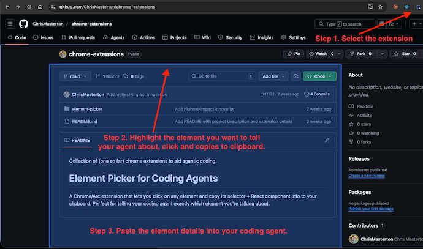

Collection of (one so far) chrome extensions to aid agentic coding.

# Element Picker for Coding Agents
A Chrome/Arc extension that lets you click on any element and copy its selector + React component info to your clipboard. Perfect for telling your coding agent exactly which element you're talking about.

## Installation

1. Clone or download this repository
2. Open Chrome and navigate to `chrome://extensions`
3. Enable **Developer mode** using the toggle in the top-right corner
4. Click **Load unpacked**
5. Select the `element-picker` folder from this repository
6. The extension icon will appear in your toolbar — click it on any page to start picking elements. You can select multiple elements into a single bundle before exporting

See the [element-picker README](element-picker/README.md) for detailed usage instructions and output format.
