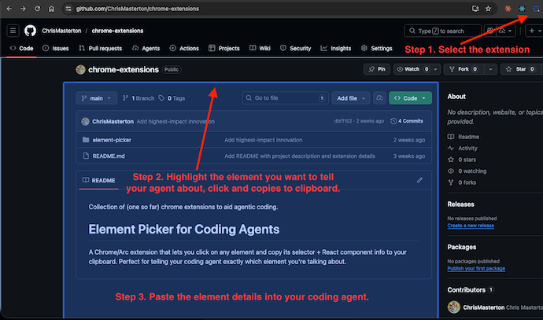

# Chrome Extensions for Agentic Coding

This repo contains browser tools that make it easier to work with coding agents against real pages, real UI state, and real visual evidence.

## Test Users

Test Users generates and stores disposable accounts, organizes them by site and environment, and fills login or registration forms from an in-page overlay. Sites are keyed by hostname and port, with explicit links for projects that span several addresses. Projects can optionally expose a same-origin nonproduction adapter to provision real role and scenario state.

Load the unpacked extension from the [`test-users`](test-users) folder. See the [Test Users README](test-users/README.md) for installation and usage.

## Vibe Digger

Vibe Digger is an in-page React debugger for vibe-coding sessions. It overlays a panel with a component inspector (hover to identify, click to pin props/hooks/state), a re-render heatmap that flashes components with cumulative render counts, and an issue digger that collects console errors, React warnings, unhandled rejections, and failed requests. One click copies everything as an agent-ready markdown bundle for Claude or Codex. On localhost it installs a React-DevTools-compatible hook before React boots, so the heatmap sees every commit with no app changes.

Load the unpacked extension from the [`vibe-digger`](vibe-digger) folder. See the [Vibe Digger README](vibe-digger/README.md) for installation and the bundled demo app.

## Element Picker QA Bridge

Element Picker has grown from a selector-copying utility into a two-way QA bridge between Chrome/Arc and Codex. It lets you point at UI, explain what you are seeing in plain language, send the full context to Codex, and ask Codex to guide you back through the page.

The big idea is simple: the browser becomes a shared review surface. You can mark the exact UI that feels wrong, add a comment in the Codex textbox, and hand Codex a structured bundle with selectors, screenshots, React/component clues, styles, scroll diagnostics, and repro hints. Codex can then answer from the real capture instead of guessing from a prose description.

The new tour workflow is the other half of that loop. You can ask Codex to take you on a tour of features it implemented, walk you through a confusing screen, or explain what changed after a fix. Codex posts a guided review tour to the local inbox, the extension loads it in the page, and you step through highlighted UI targets with Codex-authored notes. If something still needs discussion, type into **Ask Codex about this step...** and send that step back as a fresh capture.

## Highlights

- Add comments directly in the QA Bridge toolbar so Codex sees the question, concern, or observation attached to the selected UI.
- Send captures to a local Codex inbox with **Send to Codex**, while keeping clipboard export available.
- Select multiple elements into one bundle with stable locators, screenshots, React/component data, accessibility details, styles, scroll diagnostics, and Playwright repro skeletons.
- Ask Codex for guided tours of implemented features, changed screens, or confusing flows, then load those tours directly in the page.
- Use tour mode to focus on one highlighted target at a time; the normal picker toolbar hides so page clicks do not accidentally add selections.
- Use **Ask Codex** during a tour step to send the highlighted target, the tour context, and your typed note back to Codex.
- Keep capture and tour artifacts under `~/CodexInbox/web-qa` so the latest browser evidence is easy for Codex to inspect.

## Installation

1. Clone or download this repository
2. Open Chrome and navigate to `chrome://extensions`
3. Enable **Developer mode** using the toggle in the top-right corner
4. Click **Load unpacked**
5. Select the `element-picker` folder from this repository
6. The extension icon will appear in your toolbar. Click it on any page to start a QA Bridge session.

For the full workflow, including `npm run inbox`, `look at latest QA capture`, guided tours, and the repo copy of the Codex companion skill, see the [element-picker README](element-picker/README.md).
